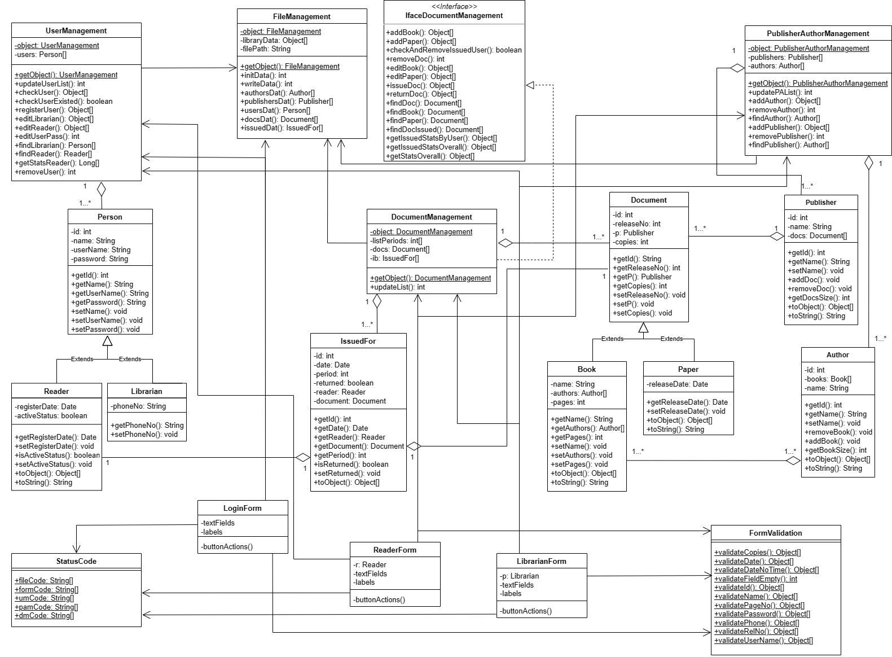

# oop-project
Quản lý thư viện

# Thông tin đăng nhập thủ thư
- Tài khoản: user1
- Mật khẩu: 88888888

# Hướng dẫn chạy
- Yêu cầu cài JDK >= 1.8
- Tải file jar trong thư mục dist và file dữ liệu library.dat về, sau đó lưu vào cùng thư mục
- Mở file jar lên để chạy (lần đầu mở có thể hiện ra thông báo không thấy file dữ liệu)

# Các chức năng
- Đăng nhập, đăng ký tài khoản thủ thư, độc giả
- Thêm, sửa, xóa, tìm kiếm tài liệu sách/báo
- Thêm, xóa, tìm kiếm các nhà xuất bản, tác giả
- Thêm, sửa, xóa, tìm kiếm tài khoản độc giả
- Thống kê tài liệu theo số lượt mượn, độc giả
- Thay đổi thông tin cá nhân tài khoản thủ thư

# Javadoc
Lưu trong thư mục dist/javadoc

# Biểu đồ lớp UML

